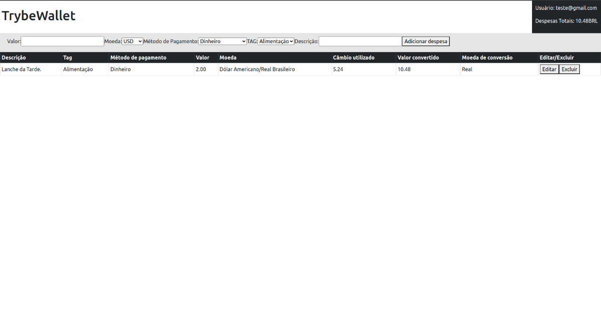

# TrybeWallet

Aplicação criada para simular uma carteira de gastos com diversos tipos de conversões.


## Habilidades

Nesse projeto foi desenvolvido as seguintes capacidades:
- Criar um store Redux em aplicações React;
- Criar reducers no Redux em aplicações React;
- Criar actions no Redux em aplicações React;
- Criar dispatchers no Redux em aplicações React;
- Conectar Redux aos componentes React;
- Criar actions assíncronas na sua aplicação React que faz uso de Redux.


## Tecnologias Utilizadas

- Aplicação foi desenvolvida em <strong>React</strong> utlizando os <strong>componentes</strong> de <strong>Classe</strong>;
- Foi utilizado o <strong>Redux</strong>, mesmo sendo uma aplicação pequena, para gerir estados entre componentes a fins de estudo;
- É utilizado <strong>Regex</strong> para validação de email ao fazer o login;
- Foi utilizado o framework de CSS <strong>Bootstrap</strong> com alguns acrescentos de css inline para a estilização.

## Rodando a aplicação


1. Clone o repositório e vá para a pasta do repositório:

```bash
git clone git@github.com:hgo19/trybewallet.git
cd trybewallet
```

2.  Instale as dependências necessárias para rodar o projeto:

```bash
npm install
```

3.  Inicie o servidor do projeto:

```bash
npm start
```


## Como funciona o projeto?

TrybeWallet é uma aplicação que logo ao ser aberta solicitará o login do usuário através da seguinte página:
<details>
<summary><strong>Imagem tela de Login </strong></summary>


</details>

O Login só é permitido em caso de um email com formato válido (```"teste@gmail.com"```), e com uma senha com mais de 6 characters.
<br>
Após isso o usuário será redirecionado para a página da carteira, onde terá um formulário para preencher com os respectivos gastos, e no canto superior direito terá o valor da despesa total.
<details>
<summary><strong>Imagem tela de Carteira </strong></summary>


</details>
Na página de Carteira é possível que o usuário adicione, edite e delete despesas, além de como dito anteriormente, ver o total no canto superior direito.

Link da aplicação: [TrybeWallet](https://hgo19.github.io/trybewallet/)

Projeto desenvolvido por: [Hugo Leonardo](https://www.linkedin.com/in/hugo-leop/).